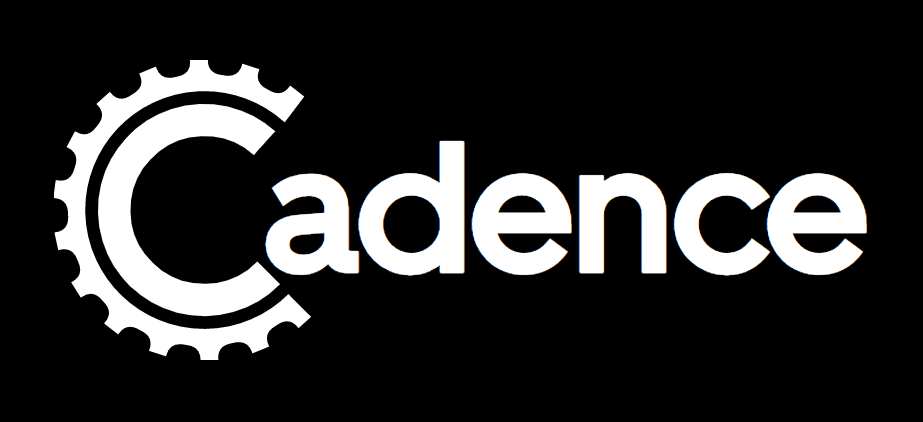

# Microservices Sagas Frameworks comparitions

## 👋 Introduction

This repository is about the result of an investigation about the Saga Pattern and the implementatation of several Sagas frameworks.

We have compared: how it's implemented, learning curve, velocity, efficiency, size of the community, documentation, among other things. 

Our objectives with this investigatin are:
- **Research** the options for frameworks available on the market right now.
- **Generate documentation**, since it lacks of information.
- **Compare** each and every technology to remark the pros and cons of each one of them. And help to find the best suited option for each of the use cases. 

 📚 [Link to the memory](https://github.com/MasterCloudApps-Projects/microservices-frameworks/blob/main/docs/memoria.pdf)

## 📊 Comparition and Excercise
In order to do the best comparition between the technologies we picked, we've chosen to implement the same excersise. And it counts with two services:

 ### Services:

- **Order Service**: This service is in charge of: creating, organize and finish every order. Here is where the Saga Pattern is implemented to communicate between other services.
- **Customer Service**: This service is for the management of the customer, the one in charge of verify the balance of each customer in order to say if the order can or not be approved. 

The excercise consist in creating a Saga on the **Order Service** to manage the communication and orquestation with the **Customer Service**. At the moment of the creation of an Order the Saga is initialized and run through different steps.

### Steps:

- **Create Customer**: We need to create a customer in order to associate it with the order we want to create. The customer need to be created with an amount of balance. 
- **Crear Orden**: Then we create the order with a specific customer.
- **Verificar Balance**: Withing the **Order Service** we verify is the customer that associeted with the order has enough balance to approved or else it will be rejected by insufficient fund.
- **Actualizar Estado Final de la Orden**: After the response of the **Customer Service** the state of the order will change to REJECTED or APPROVED.

## 👨‍💻 Frameworks

The **frameworks** we chose are:

## Axon:

 
Is a framework developed for the construction of microservices controlled by events, it's based on CQRS and Event Sourcing arquitecture. And it can implement the Saga Pattarn between them.

For more information about Axon Framework, click [here](https://docs.axoniq.io/reference-guide/) for the documentation.

[Example with Axon Framework](https://github.com/MasterCloudApps-Projects/microservices-frameworks/tree/main/Axon%20Framework) : The example specified before implemented with this framework.

 ## Eventuate:

 

Eventuate Tram Sagas is a framework used to implemen the Saga Pattern between microservices. It uses Java with Sprin Boot, Micronaut or Quarkus. It's based on the Eventuate Tram framework, that works while sending asynchronous mesagges between the differents services. This allow the microservices to quickly update their state and publish this informatin as messages or events to other services.

For more information about Eventuate, click [here](https://eventuate.io/docs/manual/eventuate-tram/latest/getting-started-eventuate-tram.html) for the documentation.

[Example with Eventuate Tram](https://github.com/MasterCloudApps-Projects/microservices-frameworks/tree/main/Eventuate) : The example specified before implemented with this framework.

 ## Cadence:

 

Cadence is a framework that has a client and a backend. It allows us to develop, create and coordinate services with Workflows (Sagas). It supports several languages such as: Go, Java, Python and Ruby. The backend is a stateless service that depends of an BBDD (Cassandra, MySQL or PostgresSQL). This manage the state and history of the workflows, coordinate the activities for each microservice and redirect the signal to the correct worker.

For more information about  Cadence Workflow, [here](https://cadenceworkflow.io/docs/get-started/) for the documentation.

[Example with Cadence](https://github.com/MasterCloudApps-Projects/microservices-frameworks/tree/main/Cadence) : The example specified before implemented with this framework.

