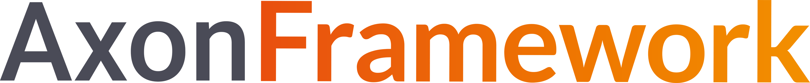
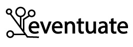

# Estudio de frameworks de microservicios (Sagas)

## Introducción

Este repositorio consiste en el resultado de una investigación sobre el patrón Saga y la implementación de varios frameworks especializados en el uso de estas.

Hemos comparado como se implementan, la curva de aprendizaje, rapidez, antigüedad, comunidad, documentación, entre otras cosas.

Nuestros objetivos con esta investigación es: 
- **Investigar** las opciones de frameworks que hay en el mercado.
- **Generar una Documentación**, ya que carecen de información.
- **Comparar** cada una de estas tecnologías para resaltar los pros y cons, y ayudar a encontrar la opción que más se ajuste a las necesidad de cada caso de uso.

## Frameworks

Los **frameworks** que hemos elegido son: 

## Axon:

 

Es un framework desarrollado para la construcción de microservicios controlados por eventos, basado en las arquitecturas CQRS y Event Sourcing y para la implementación de Sagas entre estos.

 [Ejemplo de Axon Framework](https://github.com/MasterCloudApps-Projects/microservices-frameworks/tree/main/Axon%20Framework/axon_saga_example) : Ejemplo simple de implementación de patrón Sagas en Axon Framework.

 ## Eventuate:

 

Eventuate Tram Sagas es un framework para implementar sagas en microservicios Java que usen SpringBoot, Micronaut o Quarkus. Está basado en el framework Eventuate Tram, que funciona mediante el envío de mensajes asíncronos entre los distintos participantes de la saga. Esto permite a los microservicios acualizar de forma automática su estado y publicar esta información como mensajes o eventos a otros servicios.

 [Ejemplo de Eventuate Tram](https://github.com/MasterCloudApps-Projects/microservices-frameworks/tree/main/Axon%20Framework/eventuate_saga_example) : Ejemplo simple de implementación de patrón Sagas en Eventuate Tram.

 ## Cadence:

 

Cadence consiste en un framework de programación (cliente) y un servicio de gestión (backend). El framework permite al desarrollador crear y coordinar funciones y soporta los lenguajes Go, Java, Python y Ruby (aunque los dos últimos no tienen soporte oficial). El backend es un servicio stateless y depende de un almacenamiento persistente, con Cassandra, MySQL o PostgreSQL. Este servicio backend maneja el historial de los workflows, coordina las actividades de cada participante, redirige las señales al worker correcto, etc..

 [Ejemplo de Cadence](https://github.com/MasterCloudApps-Projects/microservices-frameworks/tree/main/Axon%20Framework/cadence_saga_example) : Ejemplo simple de implementación de patrón Sagas en Cadence Workflow.

